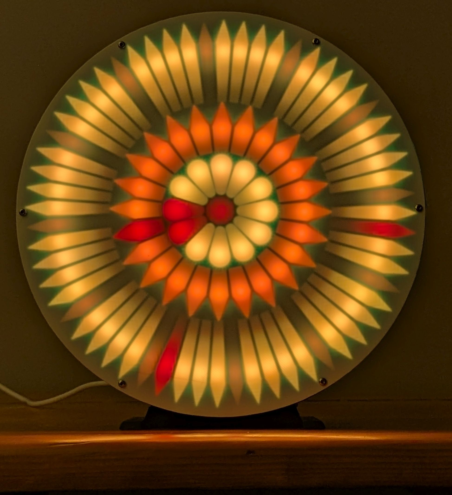
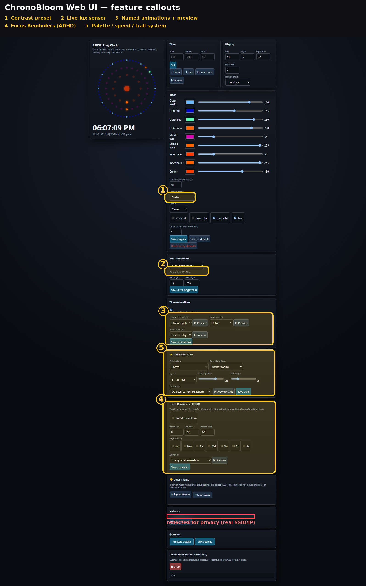

# ChronoBloom

A 3-ring NeoPixel wall clock on the Seeed XIAO ESP32-C3. Seconds sweep the outer 60-LED ring, minutes on the 24, hours on the 12. Web UI, NTP sync, OTA updates, ambient-light auto dimming, and Focus Reminder nudges for when you lose track of time. The diffused rings bloom like a flower, hence the name.



[](https://www.youtube.com/watch?v=KO6YdUoTq6A)

## Why I built it

I went downstairs to print a coloring page. On the way I found a project that needed me. An hour
later I came back up empty-handed and got: Dad, I thought you were printing me a coloring page.

That's the tendency this clock is built around. I hyperfocus, and alarms don't fix it. One lands
mid-thought, I swipe it away, and I've already forgotten it. A change of light in the room does
work. So I put it in the thing I already look at.

The clock doesn't nag and there's nothing to dismiss. Every so often the light does something slow
and obvious at the edge of your vision, and you get to decide what happens next. An alarm demands.
A nudge asks. It helps that it's pretty, and that it's already on the wall doing a job, so I never
resent it going off.

ChronoBloom is a clock built by a dad to keep time, and to keep life above the project at hand.
Look up. Shift gears. Tend to what matters.

The feature is called Focus Reminders and it's in [docs/FOCUS_REMINDERS.md](docs/FOCUS_REMINDERS.md).
Everything else on this clock got built around it.

### About the photos and the video

They don't do it justice, and I don't think a camera can. These are bright, narrow-band
addressable LEDs behind a diffuser. Your eye adapts locally, so a deep saturated red sitting
right next to a pale gold reads correctly, both at once. A sensor can't do that. It clips
whichever channel is brightest, fights the white balance, and blooms the highlights, so the
saturated hues come back either washed out or blown to white.

Getting even these shots took far more takes than it should have (ISO 10, 1/50, dark room) for
quality I'd call barely acceptable. So treat them as a hint, not a record. In other words it
looks better in person, and that's the one thing here I can't show you.

## What it does

- Time from NTP over WiFi, with timezone and DST rules. No RTC chip.
- Web UI on your LAN for colors, brightness, animations, and per-ring settings
- Seven face themes, six named for real blooming flowers (Moonflower, Cherry Blossom, Ember Dahlia, Lotus Pond, Sunflower, Bird of Paradise) and built from that flower's own colors
- Eleven curated contrast presets, plus nine colors you can set one ring element at a time
- Animation palettes are radial: petals on the outer ring, throat on the inner, stamen at the
  center, color ramping rim to core so a chime or a nudge reads as the clock blooming
- Quarter-hour, half-hour, and top-of-hour chime animations (3/3/5 styles)
- A light sensor drives auto-brightness. Pitch black room, LEDs sleep. Light returns, clock wakes.
- Focus Reminders: visual nudge animations at intervals you pick, built for interrupting hyperfocus. A peripheral ask, not an alarm.
- WiFi setup in the browser at flash time, or via captive portal on first boot. No hardcoding credentials.
- OTA firmware updates from a browser after the first USB flash
- Settings persist in EEPROM, with a user-saved defaults slot

## How this compares

[WLED](https://kno.wled.ge/) is a brilliant effects engine with a huge ecosystem, and it beats this project on effect count and community by a mile, but a ring clock like this one is a usermod you compile yourself. [Clockwise](https://github.com/jnthas/clockwise) is a browser-flashable 64x64 matrix clock, and nothing here touches its pixel-art faces. ChronoBloom is clock-first for this three-ring shape: per-ring hands, chimes, focus nudges, a per-frame power budget, lux sleep, and its own browser flasher. If you want an LED playground, run WLED. If you want this clock, this is its firmware.

## Bill of materials

Prices swing. Shop around.

| Part | Qty | Notes | Where |
|---|---|---|---|
| Seeed XIAO ESP32-C3 | 1 | The brain. USB-C, WiFi, tiny. About $10 for one, cheaper per board in a 3-pack. | [Amazon, single](https://www.amazon.com/dp/B0B94JZ2YF?tag=maestro8484-20) / [Amazon, 3-pack](https://www.amazon.com/dp/B0DGX3LSC7?tag=maestro8484-20) |
| WS2812B 241-LED ring set | 1 | Sold as a 9-ring kit (WESIRI), about $26. You use the 60, 24, and 12 rings plus 1 loose pixel for the center. Rest goes in the parts bin. Rings come pre-assembled with 3-wire JST leads. | [Amazon](https://www.amazon.com/WESIRI-WS2812B-Individually-Addressable-Controller/dp/B083VWVP3J?tag=maestro8484-20) |
| VEML7700 lux sensor module | 1 | Optional but worth it. Auto-brightness and dark-room sleep. Usually sold as a 2-pack. | [Amazon](https://www.amazon.com/dp/B0DRRGVTLH?tag=maestro8484-20) |
| Momentary push buttons | 2 | Time up/down, factory reset combo. Prewired 7mm ones save you a soldering job. | [Amazon](https://www.amazon.com/Gebildet-250VAC-Prewired-Momentary-Railway/dp/B083JWJPW5?tag=maestro8484-20) |
| USB-C phone charger, 2A | 1 | The clock has a USB-C socket on the back. Any phone charger does it. I run mine on 2A. You almost certainly own one already. | Whatever is in your drawer |
| 300 ohm resistor | 1, optional | Inline on the LED data line. Good practice, and it costs nothing if you have one. Mine run fine without it, so do not let a missing resistor stop you building. | Parts bin, or any resistor kit |
| M2 and M3 self-tapping screws | 6 each | Frame assembly. The M2s secure the outer pieces inward; they do not reach all the way through the 2mm holes, so the stack itself is aligned with filament pins and a little superglue (see [docs/PRINTING.md](docs/PRINTING.md)). An assorted box covers both sizes and costs less than buying them separately. | [Amazon](https://www.amazon.com/gp/product/B0GT4PFGSK?tag=maestro8484-20) |
| A few cm of 1.75mm filament | scrap | Cut into 10-15mm pins for aligning the frame ring, spacer and reflector. Any spare filament works. | Your scrap bin |
| Superglue | a drop | Bonds the frame ring, spacer and reflector once the pins have them aligned. | Whatever is in your drawer |

**Why 2A is enough.** All 97 LEDs at full white would want about 5.8A, which sags the rail and browns
the board out. The firmware never lets that happen: before every frame it adds up what the pixels are
about to draw and, if it would cross the budget, dims that one frame to fit. The ceiling is set to
1800mA, sized for a 5V 2A supply. Normal frames pass through untouched.

*Some links above are Amazon affiliate links. As an Amazon Associate I earn from qualifying purchases. It costs you nothing extra and it doesn't change which parts I recommend. Buy them anywhere you like, the build doesn't care.*

Plus a 3D printer, a spool of basic PLA, a bit of white PLA for the front diffuser, some wire, and hot glue or cable ties.

## Build it, step by step

Six steps from a box of parts to a running clock. Each one has a check. If a check fails, jump to the matching row in [If it doesn't work](#if-it-doesnt-work).

**What you need to be able to do:** print, and ideally solder a little. Flashing needs no toolchain, it's a web page.

The rings arrive pre-assembled with 3-wire JST connectors, so nothing here is fine-pitch or fiddly. Soldering the chain is about getting a joint that stays put in a clock hanging on a wall for years, not about making the connection possible in the first place. If you buy the XIAO with pins presoldered, and use the prewired buttons from the BOM, you can get most of the way with a scrap of protoboard and Dupont jumpers. You can force Dupont pins into the JST housings too, but they are the wrong size for it and it will let you down eventually, so solder the ring chain if you can.

1. **Print the parts.** Print the 8" set (below): the frame ring, the **reflector** that sits behind the LEDs and shapes the light into pointed hands, the **front diffuser** that softens them into a bloom, the **spacer** that sets the depth and keeps light from bleeding between rings, the back cover and the stand. The reflector and the diffuser do opposite jobs, so do not swap them, and the spacer is not optional. Settings and the front-diffuser rules are in [docs/PRINTING.md](docs/PRINTING.md). Basic PLA for everything except the front diffuser, which has to be white.
   *Check:* parts release cleanly from the bed, and the three ring seats hold the 60, 24, and 12 LED rings without forcing.
2. **Wire it.** Follow [Wiring](#wiring). Ring data leaves GPIO10, ideally through the 300 ohm resistor, the rings feed from the XIAO's 5V pin, and the sensor takes 3V3.
   *Check:* meter on continuity across 5V and GND before you plug anything in. No beep means no short.
3. **Flash the firmware.** Easiest is the browser flasher at [maestro8484.github.io/ChronoBloom/flasher](https://maestro8484.github.io/ChronoBloom/flasher/). Building from source works too, see [Flash it](#flash-it).
   *Check:* within a few seconds the rings glow blue, or the browser offers to set up WiFi. Blue means the firmware is alive.
4. **Get it on WiFi.** Use the browser WiFi setup if it appears, or join the `esp32c3-clock-setup` network and pick yours. See [WiFi setup](#wifi-setup).
   *Check:* `http://esp32c3-v3-8inch.local/` opens the web UI.
5. **Set your time zone.** In the web UI, Time & light, Time zone. Pick a zone or paste your own.
   *Check:* the clock shows your correct local time within a few seconds. No reboot needed.
6. **Fit the front diffuser and close it up.** The thin printed white PLA sheet sits over the rings.
   *Check:* the light blooms soft and even, with no single LED points poking through.

## Two builds

### 8" build (start here)

The recommended path, and the one the files here are tuned for. The scale is what it is: sized so the rings from the 241-LED kit seat precisely, not to suit any particular printer. Largest part is 209 mm square, which fits a 220 mm bed (Ender 3 class) and sits comfortably on a 256 mm one. Single NeoPixel chain of 97 LEDs: the three rings, then the center pixel. A thin white PLA front diffuser over the face. A desk kickstand ships with the files; there's no wall-mount feature in the 8" parts, so hanging it is on you. Weighs about 500g.

Build environment: `esp32c3_v3_8inch`

### 15" build (showcase)

198% scale, which is where the outer ring's LED spacing lands right. Frame prints in thirds with alignment pins. The front diffuser needs one of:

- Laser-cut acrylic (600mm x 410mm bed) with parchment paper behind it
- 0.5mm white PLA face printed on an XXL-bed printer

Separate center pixel strip on GPIO20. This is the wall piece. Build the 8" first, then decide if you want to go big.

Build environment: `esp32c3_v3_15inch`

### 3D print files

Current 8" set: [docs/publish/ChronoBloom_3D_Files/ChronoBloom_8inch/v11/](docs/publish/ChronoBloom_3D_Files/ChronoBloom_8inch/v11/). Eight files, including one assembly 3MF with the print profiles already set. 15" set: [ChronoBloom_15inch/](docs/publish/ChronoBloom_3D_Files/ChronoBloom_15inch/). Print settings and the front-diffuser rules are in [docs/PRINTING.md](docs/PRINTING.md). CC BY 4.0, credit Steve Manley (see [NOTICE](NOTICE)).

Two of those parts do opposite jobs and the names matter. The **reflector** sits behind the LEDs and shapes the light into pointed hands, and that's the part remixed from Steve Manley's design. The **front diffuser** is a separate thin white sheet over the face that softens the pixels into a bloom. That one's mine, and it's the fussy one to print.

The **spacer** is the third one people skip, and it earns its place twice. Its raised rings stand exactly as tall as the WS2812B rings sit once they're seated in the reflector, so the stack closes at the right height, and those same rings sit between the 60, the 24 and the 12 as walls so one ring's light doesn't wash into the next. Flat side faces away from the front of the clock.

**Holding it together.** The M2 screws pull the outer pieces inward, but they aren't long enough to run the whole way through the 2 mm holes, so don't expect one screw to clamp the whole sandwich. What works: cut 10 to 15 mm lengths of 1.75 mm printer filament and push them into those 2 mm holes as alignment pins, they grip tightly, then a little superglue between the frame ring, the spacer and the reflector locks the stack. Filament aligns, glue holds, screws handle the outer pieces.

The LED rings drop straight into the recessed seats in the printed core, no forcing, no rework. <!-- TODO: the OD numbers above (~175mm/~88mm/~50mm) are still the kit listing's stated sizes, not a caliper reading. Get exact numbers before a Printables upload if precision matters there. -->

## Wiring

```
XIAO Pin    GPIO    Function                Notes
─────────────────────────────────────────────────────────────
D10         GPIO10  NeoPixel data (rings)   Through 300 ohm resistor (optional)
D7          GPIO20  NeoPixel data (center)  15" build only
D3          GPIO5   Button UP               INPUT_PULLUP, polled
D9          GPIO9   Button DOWN             INPUT_PULLUP, polled
D4          GPIO6   I2C SDA                 VEML7700
D5          GPIO7   I2C SCL                 VEML7700
5V/VIN      -       LED power rail          Fed from XIAO 5V pin (USB-C VBUS); one charger powers everything
GND         -       Common ground           Board and LED rings
3V3         -       VEML7700 power only     Do NOT power LEDs
─────────────────────────────────────────────────────────────
AVOID: GPIO2, GPIO8 (boot strapping); GPIO3/GPIO4 (JTAG)
```

Don't hold the DOWN button (GPIO9) at power-on. It's the ESP32-C3 boot pin.

### Chain order

One data line runs through everything, biggest ring first, each ring's DOUT into the next one's DIN:

```
GPIO10 --[300 ohm]--> DIN [ 60-ring ] DOUT --> DIN [ 24-ring ] DOUT --> DIN [ 12-ring ] DOUT --> center pixel
                          seconds and                24h hand                12h hand              status
                          minutes
```

That's 97 LEDs on one wire, and the firmware counts them in exactly that order: the center is
the last pixel in the chain. Get the order wrong and the clock lights up but the face is
scrambled, because every index lands on the wrong ring.

The rings all run the same way, outer to inner, most LEDs to fewest. Watch the DIN and DOUT
markings on each ring rather than guessing from the physical layout.

They come pre-assembled with 3-wire JST leads, one set in and one set out: 5V, ground and data.
That makes the direction easy to read, and it means you can dry-fit the whole chain and power it
up to check the order before committing to solder.

**The center pixel can be its own wire instead.** The 15" build already does this, on GPIO20,
and the firmware supports it as a build option. Worth doing if you'd rather drive the center
from something else, since it is only the status indicator: it shows WiFi and board state, and
the web UI can set it to a bloom pulse, status only, off, or a temperature readout if you ever
add a sensor for it.

Full pin maps, LED indexing, power math, and assembly notes: [docs/HARDWARE.md](docs/HARDWARE.md)

## Flash it

Easiest way: [maestro8484.github.io/ChronoBloom/flasher](https://maestro8484.github.io/ChronoBloom/flasher/). Chrome or Edge on a desktop, plug the board in over USB-C, click the button. No install.

If you'd rather build from source, that path stays fully open too. Needs [PlatformIO](https://platformio.org/) (VS Code extension or CLI).

```
git clone https://github.com/Maestro8484/ChronoBloom.git
cd ChronoBloom
```

The 8" is what `pio run` builds by default. Pass `-e esp32c3_v3_15inch` if you want the 15".

First flash over USB:

```
pio run -e esp32c3_v3_8inch -t upload --upload-protocol esptool --upload-port COMx
```

Swap `COMx` for your port (`/dev/ttyACM0` on Linux). Serial monitor runs at 115200.

Every flash after that is OTA from a browser:

1. Build: `pio run -e esp32c3_v3_8inch`
2. Open `http://esp32c3-v3-8inch.local/update`
3. Upload `.pio/build/esp32c3_v3_8inch/firmware.bin`

Inner ring shows blue during update, green on success, red on failure. Device reboots itself.

## WiFi setup

No credentials in code. On first boot the clock listens over the same USB cable for a browser-based WiFi setup (the flasher page above may offer this right after flashing). Type your network name and password there and you're done.

If that doesn't show up, or you skip it, the clock opens its own captive portal instead:

1. Join the WiFi network `esp32c3-clock-setup` from your phone (no password)
2. A setup page opens (or go to `http://192.168.4.1`)
3. Pick your network, enter the password
4. Clock saves it and connects. It remembers across power cuts

After that it auto-connects on boot. If the password changes or the network disappears, the portal comes back.

Then open the web UI: `http://esp32c3-v3-8inch.local/` (or the IP from your router's device list).

## The web UI

Everything is set from here. No app, no account, no cloud. It is one page served off the clock itself, so it works on a phone or a laptop on the same network.



Quick controls sit at the top for the things you change often. The four sections below them hold the rest: motion and nudges, colors and rings, time and light, and system tools like firmware updates and settings backup.

There's a full tour of it on video, about three and a half minutes, every setting: [ChronoBloom web UI walkthrough](https://www.youtube.com/watch?v=FKXAHg8D2Fs).

**One thing to know before you hang it up.** There's no password on any of this. Anyone who can reach the clock on your network can open the page, change every setting, read which network it's joined to, and push new firmware to it. That's a deliberate trade for a thing that lives on your wall and gets set up once, and it's the same trade most LAN gadgets make, but it does mean this belongs on your home network and not on the open internet. Don't port-forward it.

If an update ever leaves it unable to boot, there's no automatic rollback. Plug it into USB and flash it again with the [browser flasher](https://maestro8484.github.io/ChronoBloom/flasher/), which is the same two minutes as the first flash.

## If it doesn't work

The likeliest snags, keyed to the build steps above.

| What you see | Step | Try this |
|---|---|---|
| Parts warp, or a ring won't seat in its seat | 1 | Slow the print, check bed adhesion. A little cleanup of stringing around the seats is normal. |
| Everything lights, but the hands are on the wrong rings | 2 | Chain order. It has to be 60, then 24, then 12, then the center pixel, each ring's DOUT into the next ring's DIN. Any other order and the firmware's indexes land on the wrong ring. |
| One ring works, everything after it stays dark | 2 | A joint failed at that point in the chain. Data only flows one way through these rings, so the break is at the DOUT of the last ring that works, or the DIN of the first that doesn't. |
| Something smells hot | 2 | Kill power immediately. Continuity-test 5V to GND before powering up again. |
| No serial port shows up when flashing | 3 | Use a USB-C cable that carries data, not a charge-only one. Close anything else holding the port (serial monitor, Arduino IDE). |
| Rings never turn blue after a flash | 3 | Reseat the cable and flash again. The rings feed from the XIAO 5V pin, so if they never light, check that joint and the data line. A weak computer USB port may not carry full demo brightness; a 2A charger will. |
| `esp32c3-v3-8inch.local` won't open | 4 | Use the clock's IP from your router's device list. Some networks block mDNS name lookup. |
| Time is wrong by whole hours | 5 | Set the time zone in step 5. A missing or bad zone falls back to UTC. |
| Light looks patchy or single dots show through | 6 | That's the front diffuser. Check it printed solid with no sparse gap in the middle, and that the surface fill came out Monotonic and not Concentric. Thickness is worth a couple of tries. See [docs/PRINTING.md](docs/PRINTING.md). |

## Docs

- [docs/HARDWARE.md](docs/HARDWARE.md): pins, LED mapping, power, construction
- [docs/PRINTING.md](docs/PRINTING.md): print settings and the diffuser
- [docs/FEATURES.md](docs/FEATURES.md): every feature, current and planned
- [docs/ANIMATIONS.md](docs/ANIMATIONS.md): animation catalog and triggers
- [docs/API.md](docs/API.md): web endpoints, settings JSON, client examples
- [docs/TROUBLESHOOTING.md](docs/TROUBLESHOOTING.md): when it doesn't work
- [docs/ARCHITECTURE.md](docs/ARCHITECTURE.md): codebase structure, for contributors
- [docs/FOCUS_REMINDERS.md](docs/FOCUS_REMINDERS.md): the focus-nudge feature in depth
- [docs/HISTORY.md](docs/HISTORY.md): the full decade-long design story
- [docs/CHANGELOG.md](docs/CHANGELOG.md): version history

## Support

One person built and maintains this as a hobby project. Support is best effort. Open an issue with the bug report or build help template and I'll get to it when I can. No SLA, no promises, but I do read everything.

If ChronoBloom saved you time, you can [buy me a coffee](https://buymeacoffee.com/maestro8484). Never expected, always appreciated.

## Origin story and credits

**Steve Manley** built the original NeoPixel Ring Clock in 2015 (Arduino Nano, DS3234 RTC, 3D printed frame). The electronics weren't the draw (ESP32s and addressable LEDs were already familiar territory). It was his 3D-printed design: the way the reflector shapes and throws the LED glow into crisp pointed hands, like a real clock. The printed reflector in this repo, the part that casts and shapes the light, is a remix of his design. The front diffuser is a separate part and a separate job, and that one is mine.

From there, a decade of builds by **Maestro8484**:

- **First edition**: Arduino Nano + RTC + two buttons. Setting time through interrupt-driven buttons was fiddly, but it ran for 2-3 years.
- **ESP8266 port**: same clock, new brain. Ran fine for years; never needed WiFi features.
- **8" build**: the replicable one, and what this repo targets. Sized until the off-the-shelf rings seated precisely. Largest part measures 209 mm square, about 8 inches, which is where the name comes from. Alongside it, a custom 10" glow-in-dark wall clock built around Steve's reflector with UV LEDs behind the frame.
- **15" build**: the 8" design scaled ~198% so the outer ring pitch exactly matches side-lit WS2812B strip LED spacing. Much print-and-diffuser trial and error; parchment paper beat every 3D-printed diffuser from 0.8mm down to 0.2mm.
- **ChronoBloom (2026)**: ground-up rewrite on the XIAO ESP32-C3: web UI, NTP, OTA, lux-sensor auto-brightness, Focus Reminders. The two buttons stay as a hardware fallback.

Thanks to Steve for the design that started all of this. Attribution: [NOTICE](NOTICE). Full story: [docs/HISTORY.md](docs/HISTORY.md).

## License

Firmware: [Apache 2.0](LICENSE). Hardware/STL files: [CC BY 4.0](LICENSE-HARDWARE).
